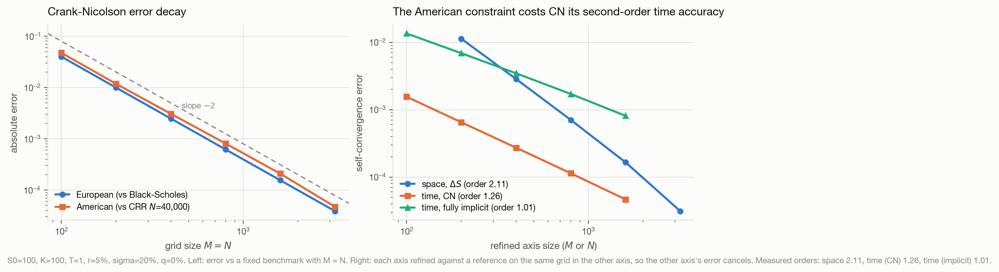
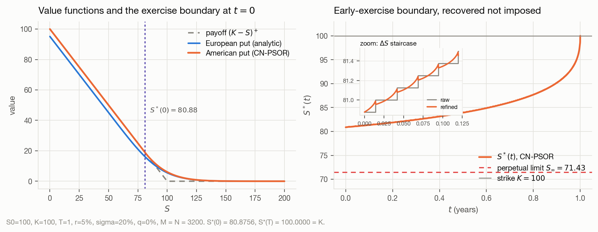
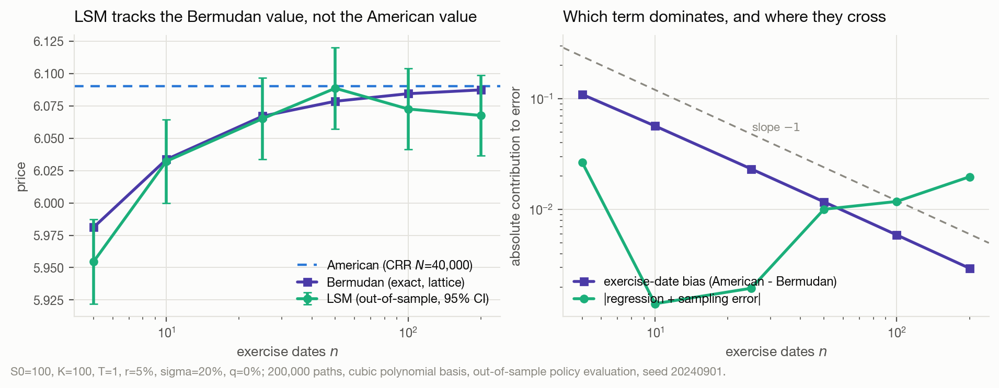
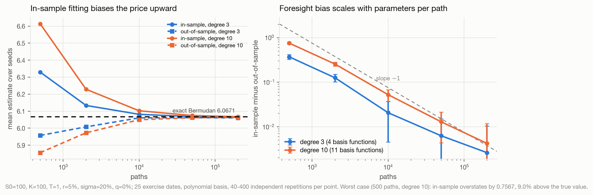
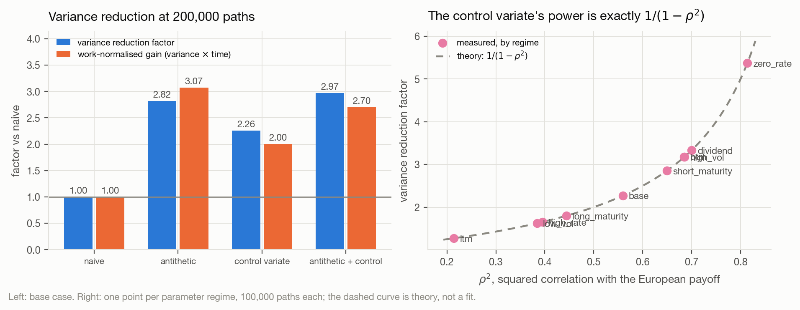
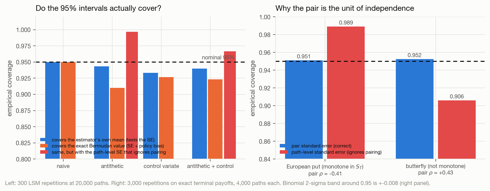
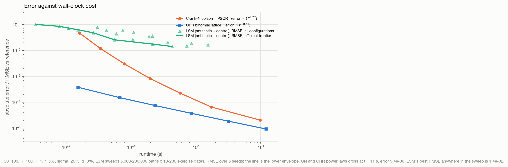

# American Option Pricing from First Principles

A numerical study of the American put under Black–Scholes, comparing
**Crank–Nicolson finite differences with PSOR** against **Longstaff–Schwartz
least-squares Monte Carlo**, with a **CRR binomial lattice** as an independent
cross-check.

Every algorithm here is implemented from scratch. No option-pricing library is
used, and every number in this README comes from an experiment in this repository.

> **Status:** Milestone 6 of 8 complete. See [`PROJECT_STATUS.md`](PROJECT_STATUS.md).

## Setup

```bash
python3 -m venv .venv && source .venv/bin/activate
pip install -r requirements.txt
pytest -q
```

## Reproducing the results

```bash
python experiments/m1_european_baseline.py
python experiments/m2_analytic_anchors.py
python experiments/m3_crank_nicolson.py    # ~4 min
python experiments/m4_longstaff_schwartz.py # ~2 min
python experiments/m5_variance_reduction.py # ~2 min
python experiments/m6_convergence.py        # ~7 min
```

Each script writes CSVs to `results/` and figures to `figures/`, and prints a
summary. [`RESULTS.md`](RESULTS.md) records every verified number.

## Current headline numbers

Base contract `S₀ = K = 100, T = 1, r = 5%, σ = 20%, q = 0`:

| Method | American put | European put |
|---|---|---|
| Black–Scholes (closed form) | — | `5.57352602` |
| CRR lattice, `N = 40,000` | `6.09035196` | — |
| CN-PSOR, `M = N = 3200` | `6.09030490` | — |

Two solvers sharing no code agree to `4.7 × 10⁻⁵` in the base case, and to
`2.5 × 10⁻⁴` or better across all ten parameter regimes.

**Measured convergence orders** (each axis refined against a reference on the
same grid in the other axis, so the other axis's error cancels):

| | order |
|---|---|
| CRR lattice, steps | `1.00` |
| CN, space `ΔS` | `2.11` |
| CN, time `Δτ` (American) | `1.26` |
| CN, time `Δτ` (fully implicit) | `1.01` |

Crank–Nicolson is formally second order in time, but the American free boundary
is only located to `O(Δτ)` — so the *measured* temporal order for the American
put is `1.26`, not `2`.




### Monte Carlo: benchmark against the Bermudan value, not the American value

LSM with `n` exercise dates prices a *Bermudan* option. Comparing it to the
continuous-exercise American value conflates two errors of opposite sign. At 50
dates the exercise-date bias is `+0.011730` and the regression-plus-sampling
error is `−0.010058` — they nearly cancel, and reporting only the American
deviation would have shown a misleadingly small `−0.0017`.



Fitting the exercise policy on the same paths you value it on is a real,
measurable data leak. At 500 paths with an 11-function basis the in-sample
estimate is **9.0% above** the true Bermudan value — higher even than the
American value it is trying to approximate:



### Variance reduction: a constant factor, not a better exponent

| method | 95% CI width | variance reduction | paths for the naive method's accuracy |
|---|---|---|---|
| naive | `0.06283` | `1.00` | `200,000` |
| antithetic | `0.03744` | `2.82` | `71,022` |
| control variate | `0.04179` | `2.26` | `88,467` |
| antithetic + control | `0.03643` | `2.97` | `67,257` |

The control variate's power matches the theoretical `1/(1 − ρ²)` to two decimal
places in all ten parameter regimes. But the fitted `SE`-vs-paths slope stays at
`−0.505` for every method: variance reduction moves the intercept, never the
`O(N^{-1/2})` exponent.



Antithetic pairs are dependent, so the standard error must be computed over
**pair means**. Using the naive path-level formula is wrong in both directions —
`1.31×` too wide for the (monotone) European put, and `0.84×` too narrow for a
non-monotone butterfly, whose 95% interval then covers only `90.6%`:



### The headline result: error against wall-clock cost

Reference solution `6.090370613 ± 9.4 × 10⁻⁸`, built by Richardson-extrapolating
two methods that share no code and quoting their disagreement as the uncertainty.

| method | error scaling | time to `10⁻³` | time to `10⁻⁴` | best achieved |
|---|---|---|---|---|
| CRR lattice | `t^{−0.55}` | `0.015 s` | `0.234 s` | `9.4 × 10⁻⁶` |
| CN + PSOR | `t^{−1.22}` | `0.197 s` | `1.740 s` | `2.0 × 10⁻⁵` |
| LSM (antithetic + control) | floors at the policy bias | **never** | **never** | `1.4 × 10⁻²` |



**Monte Carlo loses this comparison by three orders of magnitude, and not because
of sampling noise.** The seed-to-seed standard deviation falls as `N^{−0.49}`
exactly as theory predicts, but the RMSE floors at `1.4 × 10⁻²` because the
exercise policy is biased — and that bias does not respond to 400,000 paths, 400
exercise dates, or a degree-16 basis. More exercise dates shrink the Bermudan
bias (`0.109 → 0.0015`, cleanly `O(1/n)`) while the accumulated regression error
*grows* (`−0.004 → +0.017`); the total is minimised around 200 dates.

The lattice beats the PDE solver throughout the tested range — CRR's `t^{−0.55}`
is exactly `O(1/N)` accuracy at `O(N²)` cost. Crank–Nicolson's error falls faster
with cost, so the fitted power laws cross at `t ≈ 11 s`. What the PDE actually
buys is not speed: it is the whole value surface, the free boundary at every time
level, and stable Greeks from the same grid.

## Mathematical background

- [`docs/01_formulation.md`](docs/01_formulation.md) — optimal stopping, the
  variational inequality and complementarity conditions, boundary conditions,
  value matching and smooth pasting, the early-exercise boundary, and the
  perpetual closed form.
- [`docs/02_crank_nicolson.md`](docs/02_crank_nicolson.md) — the finite-difference
  derivation: coefficients, the θ-scheme, boundary rows, the discrete LCP, PSOR,
  M-matrix conditions, and Rannacher start-up.

## Layout

```
src/amopt/     library: black_scholes, binomial, config, plotting
tests/         pytest suite
experiments/   runnable scripts producing results/ and figures/
results/       CSV outputs (source of truth for all documented numbers)
figures/       PNG outputs
docs/          mathematical derivations
paper/         final research report
```
