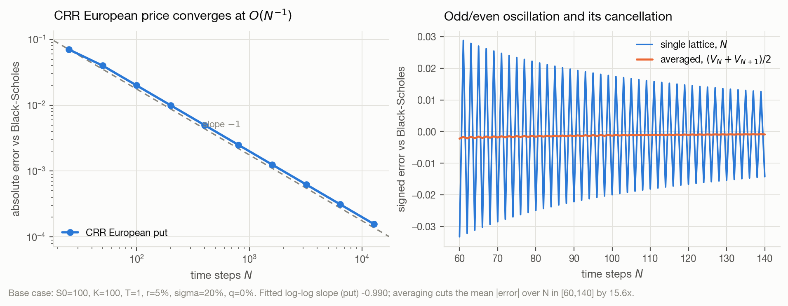

# American Option Pricing from First Principles

A numerical study of the American put under Black–Scholes, comparing
**Crank–Nicolson finite differences with PSOR** against **Longstaff–Schwartz
least-squares Monte Carlo**, with a **CRR binomial lattice** as an independent
cross-check.

Every algorithm here is implemented from scratch. No option-pricing library is
used, and every number in this README comes from an experiment in this repository.

> **Status:** Milestone 1 of 8 complete. See [`PROJECT_STATUS.md`](PROJECT_STATUS.md).

## Setup

```bash
python3 -m venv .venv && source .venv/bin/activate
pip install -r requirements.txt
pytest -q
```

## Reproducing the results

```bash
python experiments/m1_european_baseline.py
```

Each script writes CSVs to `results/` and figures to `figures/`, and prints a
summary. [`RESULTS.md`](RESULTS.md) records every verified number.

## Current headline numbers

Base contract `S₀ = K = 100, T = 1, r = 5%, σ = 20%, q = 0`:

| Method | American put | European put |
|---|---|---|
| Black–Scholes (closed form) | — | `5.57352602` |
| CRR lattice, `N = 12800` | `6.09031197` | `5.57336980` |

The CRR European price converges at a measured log–log slope of `−0.990`
(first order, as expected), and satisfies put–call parity on the lattice to
`3.15 × 10⁻¹¹`.



## Layout

```
src/amopt/     library: black_scholes, binomial, config, plotting
tests/         pytest suite
experiments/   runnable scripts producing results/ and figures/
results/       CSV outputs (source of truth for all documented numbers)
figures/       PNG outputs
docs/          mathematical derivations
paper/         final research report
```
